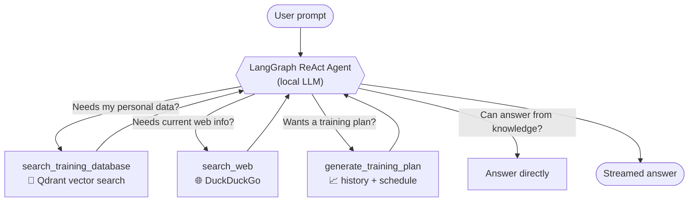
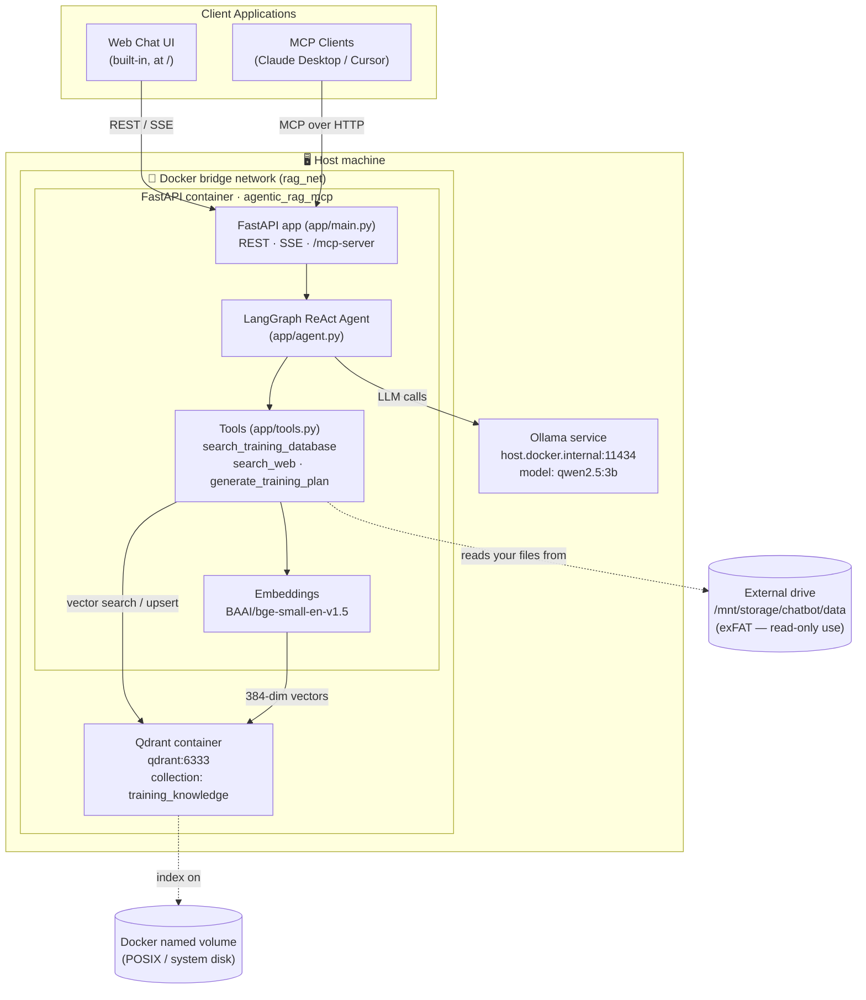
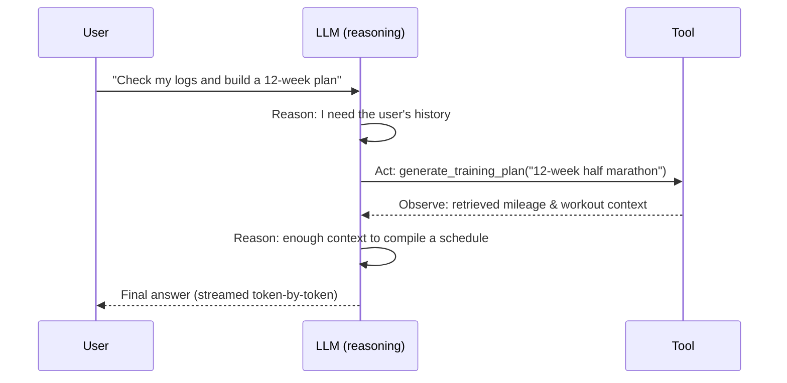
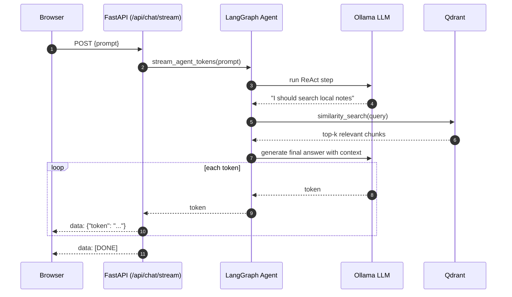
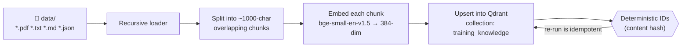

# 🧠 Local Agentic RAG Backend & FastMCP Server

A privacy-focused, **100% locally hosted** AI backend built with **FastAPI**,
**LangGraph**, the **Qdrant** vector database, **Ollama**, and **FastMCP**.

It acts as an **agentic gateway** that exposes:

- a **Server-Sent Events (SSE) streaming REST API** for web UIs, and
- a native **Model Context Protocol (MCP)** interface for clients like Claude
  Desktop or Cursor.

Everything runs inside Docker on resource-constrained local hardware (a
Raspberry Pi, mini-PC, or home server) backed by an external drive. No API keys,
no cloud, no data leaving your machine.

> 📚 **This repository is written to be *learned from*.** Alongside the code you
> will find diagrams and short explanations of every concept (RAG, agents,
> ReAct, embeddings, vector search, MCP, SSE). If a term is new to you, read the
> [Concepts Explained](#-concepts-explained) section first.

---

## 📑 Table of Contents

1. [What Is This Project?](#-what-is-this-project)
2. [Concepts Explained](#-concepts-explained)
3. [System Architecture](#-system-architecture)
4. [How the Agent Thinks (ReAct loop)](#-how-the-agent-thinks-react-loop)
5. [Request Lifecycle](#-request-lifecycle-streaming-chat)
6. [Ingestion Pipeline](#-ingestion-pipeline)
7. [Hardware & Model Allocation](#-hardware--model-allocation)
8. [Repository Structure](#-repository-structure)
9. [Tool Specifications](#-tool-specifications)
10. [How to Run](#-how-to-run)
11. [API Endpoints & Usage](#-api-endpoints--usage)
12. [Testing](#-testing)
13. [Improvements Over the Base Spec](#-improvements-over-the-base-spec)
14. [Troubleshooting](#-troubleshooting)

---

## 💡 What Is This Project?

Unlike a standard RAG backend that **blindly searches a database on every
prompt**, this project uses a **LangGraph ReAct agent** running locally via
Ollama (`qwen2.5:3b`). The agent decides *for itself*, per request, what to do:



1. **Should I search local knowledge?** → Queries Qdrant for personal notes,
   workout logs, and documents.
2. **Should I search the web?** → Queries DuckDuckGo for current information.
3. **Should I generate an athletic plan?** → Retrieves historical training
   trends and compiles a progressive schedule.
4. **Should I answer directly?** → Uses pure LLM reasoning when no external
   context is needed.

---

## 🎓 Concepts Explained

If you are new to this space, here is the whole stack in plain language.

| Concept | What it means here | Why it matters |
| --- | --- | --- |
| **LLM (Large Language Model)** | `qwen2.5:3b`, a text model run locally by **Ollama**. | It is the "brain" that reads your prompt and writes answers. |
| **Ollama** | A tool that downloads and serves LLMs on your own machine over HTTP (`:11434`). | Gives you a private, offline model — no OpenAI bill. |
| **RAG (Retrieval-Augmented Generation)** | Before answering, the app can *retrieve* relevant text from your documents and feed it to the LLM. | LLMs don't know *your* notes; RAG injects that context so answers are grounded in your data. |
| **Embeddings** | `BAAI/bge-small-en-v1.5` turns text into a 384-number vector capturing its meaning. | Similar meanings → nearby vectors, which is how semantic search works. |
| **Vector Database (Qdrant)** | Stores those vectors and finds the *closest* ones to a query vector. | Lets you search by **meaning**, not just keywords. |
| **Chunking** | Long documents are split into ~1000-character overlapping pieces before embedding. | LLMs and search work better on focused passages than whole files. |
| **Agent** | An LLM that can *choose to call tools* and loop until it has an answer. | Turns a passive chatbot into something that *acts* (searches, plans). |
| **ReAct** | "**Rea**son + **Act**": the agent alternates between thinking and calling tools. | A simple, reliable pattern for tool-using agents. |
| **LangGraph** | A library that runs the ReAct loop as a small state graph. | Handles the "think → call tool → observe → repeat" wiring for us. |
| **Tool** | A Python function the agent may call (`search_web`, etc.). | The agent's "hands" — how it reaches the outside world. |
| **MCP (Model Context Protocol)** | An open standard so external apps (Claude Desktop, Cursor) can call our tools. | Makes this backend usable *inside* other AI clients. |
| **FastMCP** | A Python library that turns functions into an MCP server. | We reuse the same tools for both REST and MCP. |
| **SSE (Server-Sent Events)** | A one-way HTTP stream of `data: ...` lines. | Lets the browser show tokens **as they are generated**, like ChatGPT typing. |
| **FastAPI** | The async web framework serving all endpoints. | Ties the LLM, tools, and streaming together over HTTP. |

**One-sentence summary:** *A local LLM (Ollama) is wrapped in a ReAct agent
(LangGraph) that can search your documents (Qdrant + embeddings) or the web
(DuckDuckGo), served over a streaming API (FastAPI/SSE) and the MCP standard
(FastMCP).*

---

## 🏗️ System Architecture



> 💡 **Why the split?** A live database (Qdrant) needs a POSIX filesystem with
> file locking and `mmap`, which exFAT/NTFS drives don't provide. So the Qdrant
> index and the embedding-model cache live on **Docker named volumes**, while
> your **bulky raw documents** live on the big external drive (reading files
> from exFAT/NTFS is perfectly safe).

---

## 🤖 How the Agent Thinks (ReAct loop)

The ReAct pattern is just a loop: the LLM **reasons**, optionally **acts** by
calling a tool, **observes** the result, and repeats until it can answer.



The loop is implemented for us by `langgraph.prebuilt.create_react_agent` in
`app/agent.py`.

---

## 🔄 Request Lifecycle (Streaming Chat)

What actually happens when you `POST /api/chat/stream`:



---

## 📥 Ingestion Pipeline

Before the agent can search your notes, you must **ingest** them: load → chunk →
embed → store. This is what `python -m app.ingest` does.



Ingestion uses **deterministic, content-derived IDs**, so re-running on
unchanged files will not create duplicates.

### Supported data formats

| Format | Best for | How it's handled |
| --- | --- | --- |
| **`.txt` / `.md`** | Plain-text notes & documents. **Name the file after its topic** (e.g. `nutrition-notes.md`) — the filename is stored as the `source` metadata so the agent knows what each document is for. | Loaded as-is, then chunked. |
| **`.pdf`** | Articles, reports, exported documents (text-based, not image-only scans). | Text extracted per page, then chunked. |
| **`.json`** | **Past training plans.** | Each plan is *flattened into readable prose* so the embedding model can reason over it, and tagged with `type` / `race` metadata. |

#### Training-plan JSON schema

A `.json` file may contain **one plan object** or a **list of plan objects**:

```json
{
  "type": "marathon",
  "race": "Lisbon Marathon 2025",
  "workouts": [
    { "day": "Week 1 - Mon", "workout": "8km easy run" },
    { "day": "Week 1 - Sat", "workout": "long run 18km" }
  ]
}
```

- **`type`** — the discipline: `marathon`, `short distance`, `paracanoe`, or
  anything else. Stored as searchable metadata.
- **`race`** *(optional)* — the target event. You can also just mention the race
  **inside a `workout` string**; it will still be embedded and searchable.
- **`workouts`** — a list of `{ "day": ..., "workout": ... }` entries. A mapping
  like `{ "Monday": "8km easy" }` is also accepted, and any extra keys on a
  workout (e.g. `distance`, `rpe`) are appended in parentheses.

The example above is embedded as:

```text
Training plan type: marathon
Race: Lisbon Marathon 2025

Workouts:
- Week 1 - Mon: 8km easy run
- Week 1 - Sat: long run 18km
```

Unknown JSON shapes are not lost — if a plan doesn't match the schema, the raw
JSON is embedded verbatim.


---

## ⚙️ Hardware & Model Allocation

All models and embeddings run locally without external API fees or third-party
data tracking.

| Component | Model Name | Engine / Provider | Footprint & Specs |
| --- | --- | --- | --- |
| **LLM (8 GB host)** | `qwen2.5:3b` | Ollama (host service) | **Default.** ~1.9 GB RAM/VRAM. |
| **LLM (4 GB host)** | `qwen2.5:1.5b` | Ollama (host service) | **Fallback.** ~986 MB RAM/VRAM. |
| **Embeddings** | `BAAI/bge-small-en-v1.5` | Hugging Face (local) | ~130 MB disk, 384 dims, ~300 MB RAM. |
| **Vector DB** | `qdrant/qdrant:v1.9.2` | Qdrant container | ~200 MB base RAM + index storage. |

> 💾 **Storage layout:** Your **raw documents** live on the big external drive
> (`/mnt/storage/chatbot/data`) and can grow toward the **200 GB** quota. The
> **Qdrant index** and **embedding cache** are kept small and live on Docker
> named volumes on the system disk (they must be on a POSIX filesystem).

**Running on a 4 GB host?** Set `MODEL_NAME=qwen2.5:1.5b` in `.env` and
`ollama pull qwen2.5:1.5b`.

---

## 📁 Repository Structure

```text
Chatboot/
├── app/
│   ├── __init__.py
│   ├── agent.py         # LangGraph ReAct agent & Ollama LLM setup
│   ├── config.py        # Pydantic-settings environment configuration
│   ├── vectorstore.py   # Embeddings + Qdrant singletons (lazy-loaded)
│   ├── tools.py         # ReAct tools (Qdrant RAG, web search, training plan)
│   ├── ingest.py        # Recursive loader & Qdrant embedding CLI
│   ├── mcp_server.py    # FastMCP server exposing the tools over MCP
│   ├── main.py          # FastAPI: REST, SSE, MCP mount & web UI
│   └── static/
│       └── index.html   # Minimal built-in streaming chat UI
├── data/                # Put your .pdf/.txt/.md/.json knowledge files here
├── tests/               # Pytest suite (mocks heavy deps, runs offline)
├── .env.example         # Environment variable template
├── docker-compose.yml   # Multi-container orchestration (app + Qdrant)
├── Dockerfile           # Python 3.11-slim application image
├── setup.sh             # One-command first-time setup helper
├── pytest.ini           # Test configuration
├── requirements.txt     # Python dependencies (validated, pinned)
└── README.md            # This file
```

---

## 🛠️ Tool Specifications

The agent dynamically selects from three registered tools (`app/tools.py`):

1. **`search_training_database`** — vector similarity search against the Qdrant
   `training_knowledge` collection using `BAAI/bge-small-en-v1.5` embeddings.
2. **`search_web`** — queries DuckDuckGo for live web information when local
   knowledge is insufficient.
3. **`generate_training_plan`** — pulls historical volume, workout logs, and
   recovery notes from Qdrant to assemble progressive athletic schedules.

The same capabilities are re-exported as **MCP tools** in `app/mcp_server.py`
(plus an `agent_chat` tool that runs the full agent).

---

## 🚀 How to Run

There are two ways to run this project: the full **Docker** stack (recommended,
matches production) or a **local dev** setup.

### ⚡ Quick start (automated)

The `setup.sh` helper does the whole first-time setup for you: creates `.env`,
creates your documents folder, checks Docker/Ollama, pulls the model, then
builds, launches and ingests.

```bash
git clone <your-repo-url> ~/Chatboot
cd ~/Chatboot
./setup.sh            # interactive — prompts before each action
# or:
./setup.sh --yes      # non-interactive: do everything without prompting
./setup.sh --no-start  # only prepare .env + folders, skip Docker
```

It's safe to re-run at any time (every step is idempotent). Prefer to
understand each step? Follow **Option A** below manually.

### Option A — Docker (recommended, manual)

**1. Prerequisites**

- **Docker & Docker Compose** installed.
- **Ollama** installed on the host, with the model pulled:

  ```bash
  ollama pull qwen2.5:3b      # or qwen2.5:1.5b on a 4 GB host
  ```

- (Optional) external storage mounted, e.g. at `/mnt/storage`.

**2. Configure environment**

```bash
cp .env.example .env
# Edit .env: set DOCS_HOST_PATH, MODEL_NAME, etc. to match your machine.
```

`.env` example:

```env
DOCS_HOST_PATH=/mnt/storage/chatbot/data
QDRANT_HOST=qdrant
QDRANT_PORT=6333
OLLAMA_BASE_URL=http://host.docker.internal:11434
MODEL_NAME=qwen2.5:3b
EMBEDDING_MODEL=BAAI/bge-small-en-v1.5
```

**3. Create the documents directory on your drive**

Only the raw-documents folder needs to exist — Qdrant's index and the model
cache use Docker named volumes and are created automatically.

```bash
mkdir -p "$DOCS_HOST_PATH"
```

> On an **exFAT/NTFS** drive, `chown`/`chmod` will fail with
> "Operation not permitted" — that's expected and harmless; those filesystems
> manage permissions at mount time. You do **not** need to change ownership.

**4. Add your knowledge base**

Copy your files into the documents folder on the drive (or into the repo's
`./data/` if you left `DOCS_HOST_PATH` at its default):

```bash
cp /path/to/my_notes/*.pdf  "$DOCS_HOST_PATH/"
cp /path/to/plans/*.json    "$DOCS_HOST_PATH/"
```

**5. Build and launch**

```bash
docker compose up -d --build
```

**6. Embed & index your documents**

```bash
docker exec -it agentic_rag_mcp python -m app.ingest
```

**7. Open the app**

- Web chat UI: `http://localhost:8000/`
- API docs (Swagger): `http://localhost:8000/docs`
- Health check: `http://localhost:8000/health`

### Option B — Local development (no Docker for the app)

Useful for hacking on the code. You still need Ollama and Qdrant reachable.

```bash
# 1. Start Qdrant (via Docker is easiest)
docker run -d --name qdrant -p 6333:6333 qdrant/qdrant:v1.9.2

# 2. Make sure Ollama is running on the host
ollama serve &        # if not already running
ollama pull qwen2.5:3b

# 3. Python environment
python -m venv .venv && source .venv/bin/activate
pip install -r requirements.txt

# 4. Point the app at localhost (defaults already do this)
export QDRANT_HOST=localhost
export OLLAMA_BASE_URL=http://localhost:11434

# 5. Ingest and run
python -m app.ingest
uvicorn app.main:app --reload --port 8000
```

> The defaults in `app/config.py` already target `localhost` for Qdrant and
> Ollama, so local dev works with no `.env` at all.

---

## 🔌 API Endpoints & Usage

Interactive OpenAPI docs are auto-hosted at **`http://<HOST_IP>:8000/docs`**.

### 1. Built-in Web Chat UI

- **URL:** `GET /` — a minimal browser client that streams tokens live.

### 2. Live Token Streaming Endpoint (SSE)

- **URL:** `POST /api/chat/stream`
- **Body:** `{ "prompt": "..." }`
- **Response:** `text/event-stream` returning `data: {"token": "..."}` chunks,
  terminated by `data: [DONE]`.

### 3. Synchronous Chat Endpoint

- **URL:** `POST /api/chat`
- **Body:** `{ "prompt": "What is my peak weekly mileage?" }`
- **Response:** `{ "response": "..." }` (waits for the full answer).

### 4. Health / Readiness

- **URL:** `GET /health` — reports Qdrant and Ollama reachability.

### 5. MCP (for MCP hosts)

- **Native MCP:** `ALL /mcp-server` — streamable HTTP transport. Point Claude
  Desktop / Cursor at `http://<HOST_IP>:8000/mcp-server`.
- **REST manifest:** `GET /mcp/manifest` — JSON list of exposed tools.
- **REST tool call:** `POST /mcp/call` —
  `{ "tool": "search_web", "input": { "query": "..." } }`.

---

## 🧪 Testing

### API smoke test

```bash
curl -N -X POST "http://localhost:8000/api/chat/stream" \
     -H "Content-Type: application/json" \
     -d '{"prompt": "Search my notes and create a 10k race progression strategy."}'
```

### Unit tests

The unit tests **stub out** Ollama, Qdrant, and the embedding models, so they
run fast and fully offline:

```bash
python -m venv .venv && source .venv/bin/activate
pip install pytest pydantic pydantic-settings langchain-core
python -m pytest
```

---

## ✨ Improvements Over the Base Spec

This implementation extends the original design with:

- **`GET /health`** readiness probe (Qdrant + Ollama), also wired into the
  Docker `HEALTHCHECK`.
- **Native MCP server** (`fastmcp`) mounted at `/mcp-server`, exposing all three
  tools plus a full `agent_chat` capability — not just REST stubs.
- **Built-in web chat UI** at `/` that consumes the SSE stream.
- **Lazy singletons** for embeddings / Qdrant / LLM so imports stay cheap and
  the app is unit-testable without heavy models loaded.
- **Idempotent ingestion**: recursive PDF/TXT/MD loading with deterministic,
  content-derived chunk IDs so re-running won't duplicate data.
- **Pytest suite** (`tests/`) that mocks heavy dependencies for fast CI.
- **Local-friendly defaults** in `config.py` (e.g. `localhost` Qdrant) so the
  app also runs outside Docker during development.

---

## 🩺 Troubleshooting

| Symptom | Likely cause & fix |
| --- | --- |
| `/health` shows `ollama: down` | Ollama isn't running or the URL is wrong. From inside Docker use `http://host.docker.internal:11434`; locally use `http://localhost:11434`. |
| `/health` shows `qdrant: down` | Qdrant container not up. Check `docker compose ps` and that `QDRANT_HOST`/`QDRANT_PORT` match. |
| Agent answers but never uses my notes | You haven't ingested yet. Run `python -m app.ingest` and confirm files are in `./data/`. |
| Ingestion finds 0 documents | Only `.pdf`, `.txt`, `.md`, `.json` are supported. Check that your files are in `DOCS_HOST_PATH` (mounted to `/app/data`), e.g. `docker exec -it agentic_rag_mcp ls /app/data`. |
| `chown: Operation not permitted` on `/mnt/storage` | Your drive is exFAT/NTFS (Windows-formatted) — it can't store Linux ownership. This is expected; skip `chown`. The app only *reads* documents from there, so it's fine. |
| Qdrant crashes / index corruption | Don't put Qdrant's storage on an exFAT/NTFS drive. This project keeps it on a Docker named volume by default — verify you didn't repoint it at the external drive. |
| Out-of-memory on a small host | Switch to `MODEL_NAME=qwen2.5:1.5b` and `ollama pull qwen2.5:1.5b`. |
| Slow first response | The embedding model downloads on first use into the Hugging Face cache; subsequent runs are fast. |

---

*Built for privacy, learning, and running entirely on your own hardware.* 🏠
